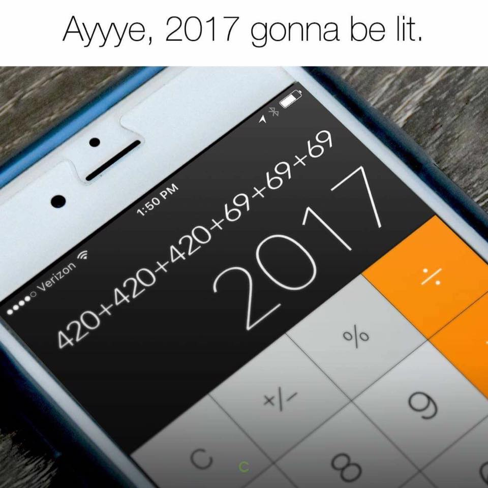
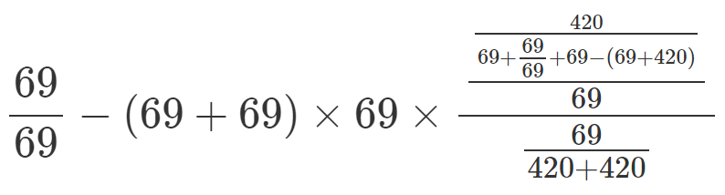

# Random Postfix Equation
Inspired by people being dumb


It's clear that this math is incorrect. I was curious if I could find a real equation that equaled 2017.

I decided to take the random approach. I'll pick a combination of random numbers from a user-given list and random operations. Currently, only 4 operations are supported, `+`, `-`, `*`, and `/`. I have a few reasons for taking this random approach.

1. Taking the sequential approach would hardly exhaust all equations if the quantity of numbers or the number of terms in the equation is large. The random approach obviously wont exaust all the equations either, it might even create duplicates, but it will help with problem #2.
2. I believe if I sequentially stepped through the possible equations, I would get solution groupings as well. For example, I'll have to go through billions of equations that start with a small number divided by something. In that case, I'd only see small numbers and never see 2017.
3. It was a bit easier to quickly POC this idea.

I used postfix because generating random infix equations would introduce ambiguity. Also, evaluating postfix equations is super simple.

#### This little header is pretty simple to use.

* Start by creating an `std::vector` of numbers that you want to be used in the randomly built equations.
* Instantiate a `RandomEquationBuilder`.
* Ask the `RandomEquationBuilder` instance to build an `Equation` for you with a specified term count.
* Finally, retreive and print the result.

```c++
const std::vector<double> NUMBERS = {1,2,3,4,5,6,7};
RandomEquationBuilder randomEquationBuilder(NUMBERS);

const int DESIRED_TERM_COUNT = 4;
Equation equation = randomEquationBuilder.build(DESIRED_TERM_COUNT);

double result = equation.evaluate();
std::cout << equation.toString() << " = " << result << '\n';
```

It turns out that 2017 is a pretty difficult number to create using an equation of only 420's and 69's. I believe that's because 2017 is prime. After trying for quite a while, I didnt find an equation until I started generating equations with 16 terms.

`69 69 / 69 69 + 69 420 69 69 69 / 69 + + 69 420 + - / * * 69 / 69 420 420 + / / -`

Which translates to the following infix



This was rendered using the MathJax formula `\frac{69}{69} - (69 + 69) \times 69 \times \frac{\frac{\frac{420}{69 + \frac{69}{69} + 69 - (69 + 420)}}{69}}{\frac{69}{420 + 420}} = 2017`

[Here is a Wolfram Alpha query representing the above](http://www.wolframalpha.com/input/?i=69+%2F+69+-+(69+%2B+69)+*+69+*+420+%2F+(69+%2B+69+%2F+69+%2B+69+-+(69+%2B+420))+%2F+69+%2F+(69+%2F+(420+%2B+420)))
